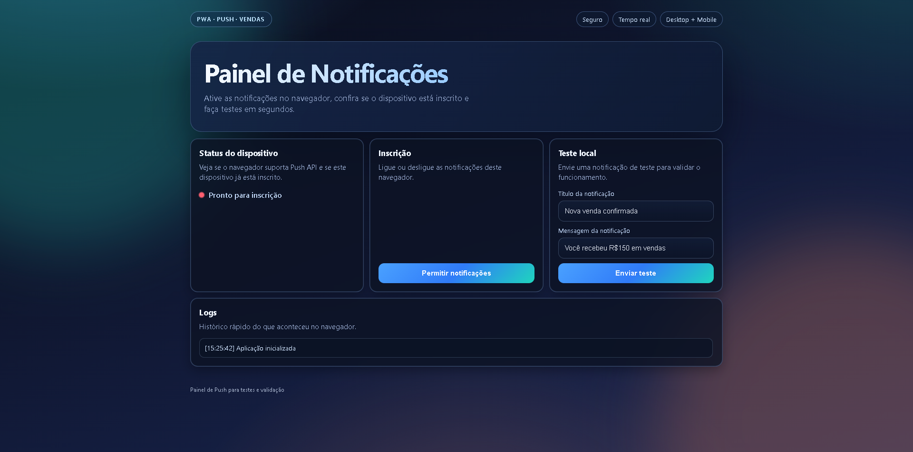
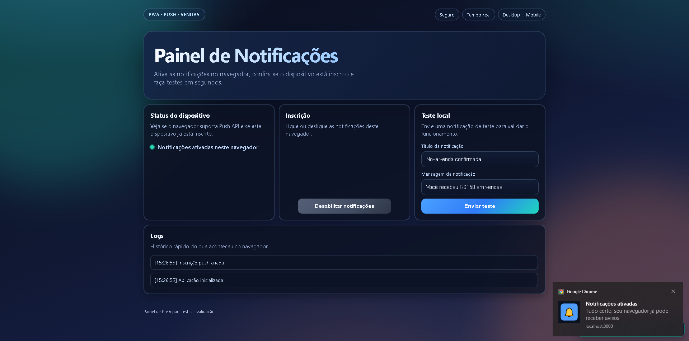

# PWA Push Notifications

Repository: https://github.com/CaioXDeveloper/pwa-push-vendas.git

Progressive Web App with a Node.js backend to manage Web Push subscriptions and send sales notifications.

## Preview

<div align="center">
  
  
</div>


## Overview

This project is a PWA with a Node.js backend to manage Web Push subscriptions and send sales notification events.

## Credits and authorization

This repository started from a pre-existing codebase used with authorization from the original owner. It was fully refactored and improved in architecture, UI, performance, and code organization.

## Stack

- Node.js + Express
- Web Push (`web-push`)
- Service Worker
- Static frontend (HTML/CSS/JS)

## Structure

```text
.
├─ public/
│  ├─ css/
│  │  └─ styles.css
│  ├─ js/
│  │  ├─ modules/
│  │  │  ├─ app-controller.js
│  │  │  ├─ constants.js
│  │  │  ├─ dom.js
│  │  │  ├─ event-bus.js
│  │  │  ├─ push-service.js
│  │  │  ├─ ui-controller.js
│  │  │  └─ utils.js
│  │  └─ main.js
│  ├─ index.html
│  ├─ manifest.json
│  └─ sw.js
├─ src/
│  └─ api/
│     └─ server.js
├─ .env.example
├─ package.json
└─ server.js
```

## Setup

1. Install dependencies:

```bash
npm install
```

2. Generate VAPID keys:

```bash
npm run generate-vapid
```

3. Create `.env` from `.env.example` and fill values.

4. Start server:

```bash
npm start
```

Open `http://localhost:3000`.

## Environment variables

| Variable | Required | Example |
| --- | --- | --- |
| `PORT` | no | `3000` |
| `BODY_LIMIT` | no | `1mb` |
| `VAPID_SUBJECT` | yes | `mailto:you@example.com` |
| `VAPID_PUBLIC_KEY` | yes | `B...` |
| `VAPID_PRIVATE_KEY` | yes | `...` |

## Endpoints

- `GET /api/public-config` returns public push config
- `POST /api/subscribe` registers subscription
- `POST /api/unsubscribe` removes subscription
- `GET /api/subscriptions` returns summarized subscriptions
- `POST /api/send-notification` sends notification to all subscriptions
- `POST /api/notify-sale` sends formatted sale notification
- `GET /api/health` service health status

## Production notes

- Use HTTPS outside `localhost`
- Persist subscriptions in a database
- Do not commit `.env`
- Add monitoring and rate limiting

## Credits

- Created by [CaioXDeveloper](https://github.com/CaioXDeveloper)
- Portfolio: [https://port-caiox.vercel.app/](https://port-caiox.vercel.app/)

